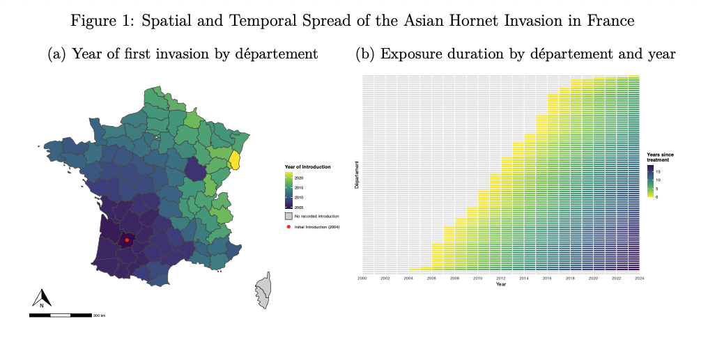
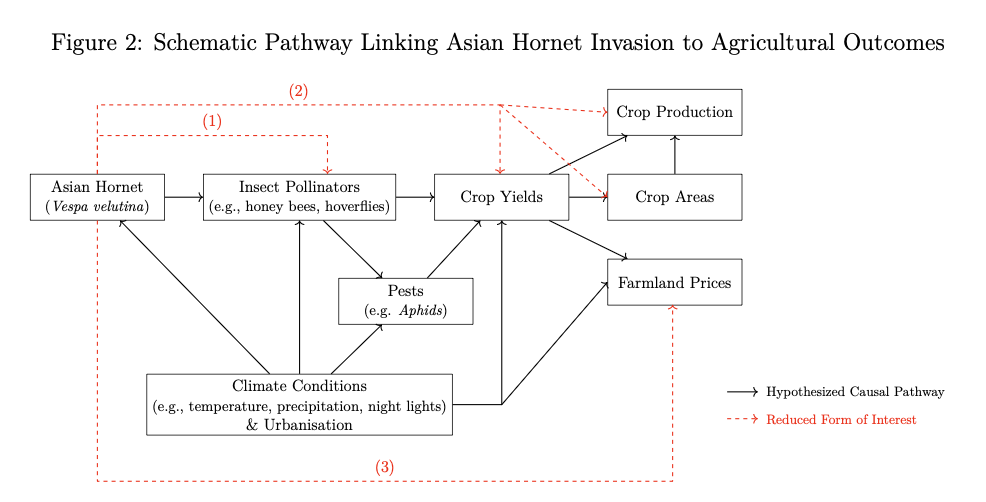
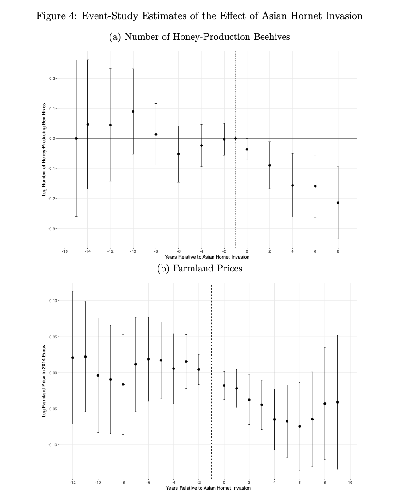

## Research Interests

My research focuses on identifying and quantifying the economic value of ecosystem services and understanding how economic activities impact ecological systems. I am particularly interested in designing policies that can better manage this bidirectional relationship.

## Working Papers

Coming soon!

<!-- WORK IN PROGRESS - Uncomment when paper is ready

### The Economic Cost of Pollinator Loss
#### Evidence from an Invasive Species

::: {.grid}

::: {.g-col-7}
**Solo-authored**

*Working Paper*

Insect pollinators are in global decline due to anthropogenic pressures, despite continued growth in the production of pollination-dependent crops. This divergence poses risks to agricultural productivity and food security, yet the economic value of pollination services remains poorly identified. As a result, policymakers face challenges in incorporating pollinators into cost-benefit analyses for conservation efforts and in addressing the negative externalities that contribute to their decline. This paper provides causal estimates of the effects of pollinator loss by exploiting quasi-exogenous variation in pollination supply from the staggered biological invasion of the Asian hornet (*Vespa velutina*) – a predator of insect pollinators – across France. Using a difference-in-differences design, I find that hornet invasion reduces managed beehive counts by 11.4%, oilseed rape yields by 5.2%, and average farmland prices by 4.3%. These results underscore the high economic value of insect pollinators for agriculture and illustrate how ecosystem health can shape economic outcomes.

[Draft](papers/pollinator-loss-draft.pdf) | [Slides](papers/pollinator-loss-slides.pdf) | [Code](https://github.com/yourusername/pollinator-study)
:::

::: {.g-col-5}

  

    <button type="button" data-bs-target="#carouselPollinators" data-bs-slide-to="0" class="active" aria-current="true" aria-label="Slide 1"></button>
    <button type="button" data-bs-target="#carouselPollinators" data-bs-slide-to="1" aria-label="Slide 2"></button>
    <button type="button" data-bs-target="#carouselPollinators" data-bs-slide-to="2" aria-label="Slide 3"></button>
  

  

    

      
      

        
Figure 1: Impact on beehive counts

      

    

    

      
      

        
Figure 2: Hornet invasion timeline

      

    

    

      
      

        
Figure 3: Event study results

      

    

  

  <button class="carousel-control-prev" type="button" data-bs-target="#carouselPollinators" data-bs-slide="prev">
    
    Previous
  </button>
  <button class="carousel-control-next" type="button" data-bs-target="#carouselPollinators" data-bs-slide="next">
    
    Next
  </button>

:::

:::

-->